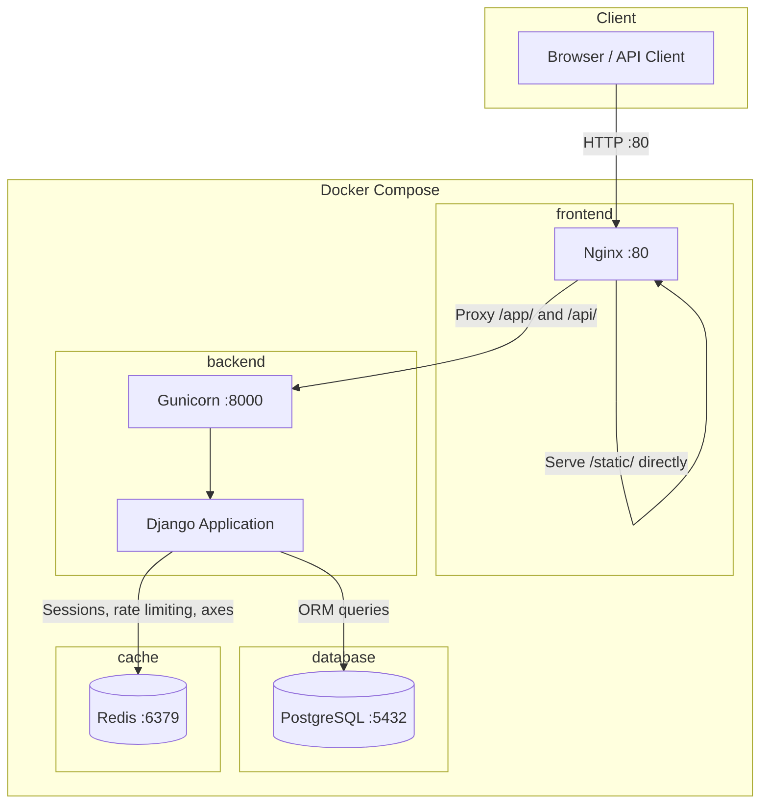
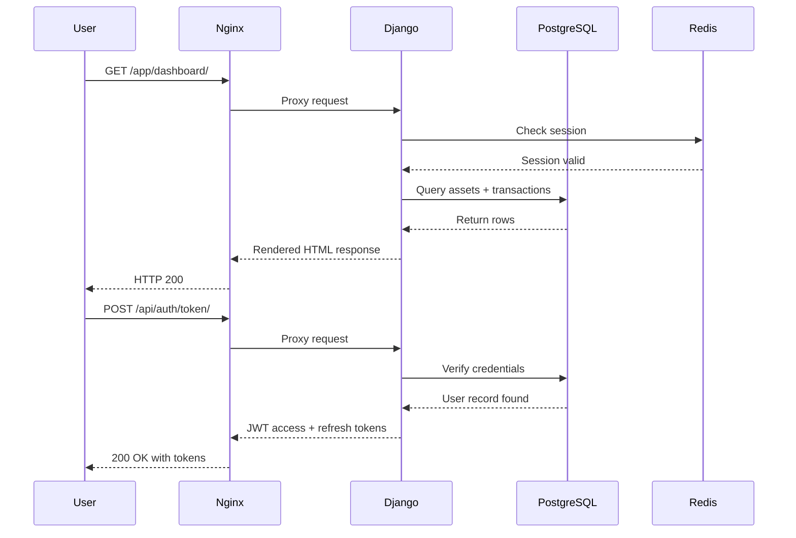
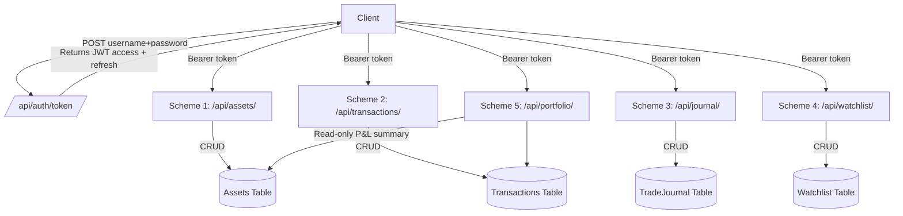
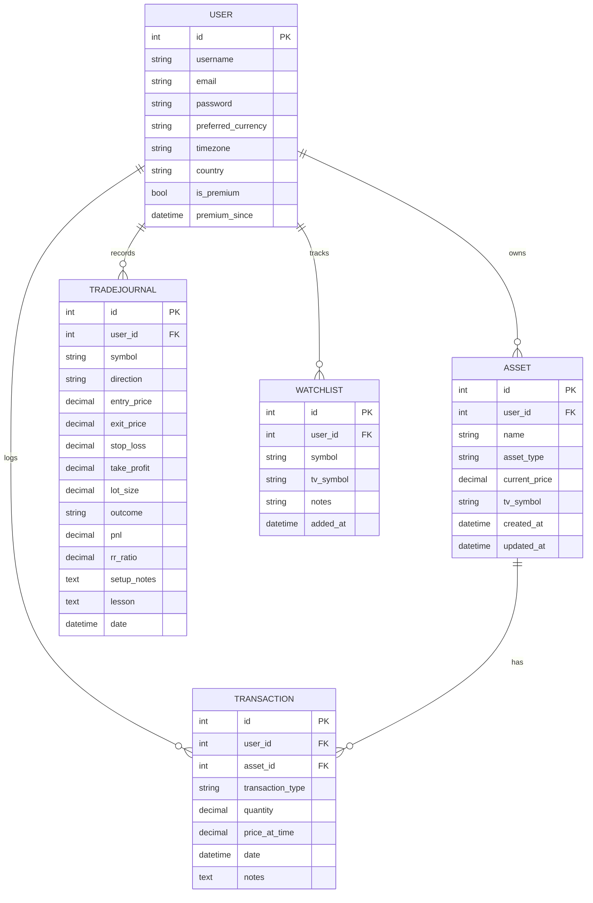
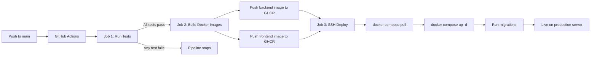
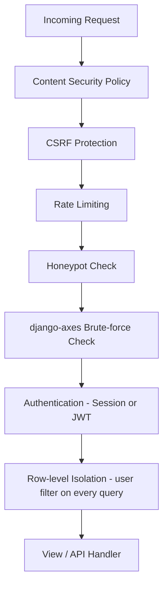

# System Architecture

## Overview

MasonTrack is a containerized Django application split into four Docker services:
- **frontend** — Nginx on port 80, serves static files and proxies requests to the backend
- **backend** — Django + Gunicorn on port 8000, handles all business logic and API
- **database** — PostgreSQL 16, stores all application data
- **redis** — Redis 7, handles sessions, rate limiting, and brute-force lockout cache

---

## Architecture Diagram

---

## Request Flow

---

## API Schemes

All endpoints below require a JWT Bearer token except `/api/auth/token/` and `/api/auth/refresh/`.

| Scheme | URL | Methods | Description |
|--------|-----|---------|-------------|
| 1 | /api/assets/ | GET, POST, PUT, DELETE | Manage portfolio assets |
| 2 | /api/transactions/ | GET, POST, PUT, DELETE | Log and view transactions |
| 3 | /api/journal/ | GET, POST, PUT, DELETE | Trade journal entries |
| 4 | /api/watchlist/ | GET, POST, DELETE | Watchlist management |
| 5 | /api/portfolio/ | GET | Full P&L portfolio summary |

---

## Database Schema

---

## Deployment Pipeline

---

## Security Layers

